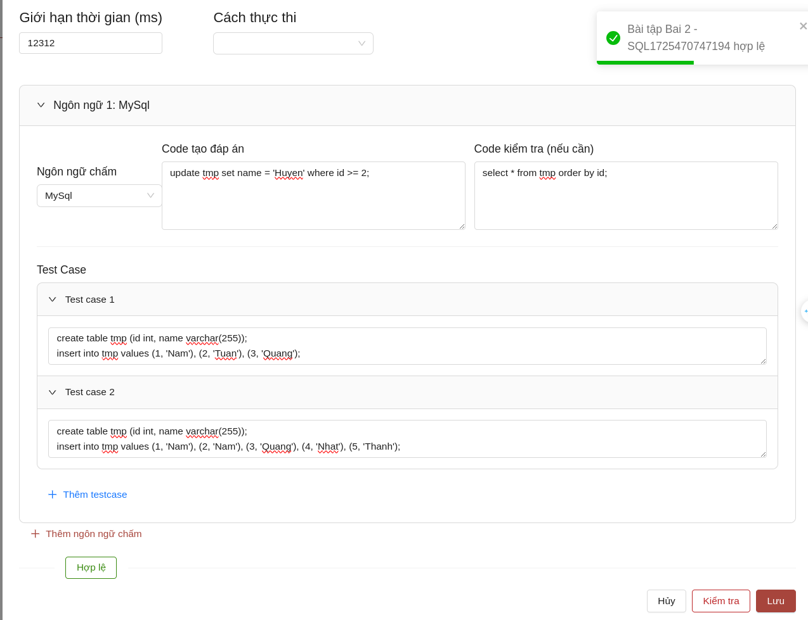

# SQL LAB DEMO

## Run Containers

```
cd demo-2/sql-lab-server
docker compose up 
```

```
cd demo-2/mysql-judge-service
docker compose up 
```

```sql
# 1. Chọn ngôn ngữ MySQL

# 2. Code tạo đáp án
update tmp set name = 'Huyen' where id >= 2;

# 3. Code kiểm tra
select * from tmp order by id;

# 4. Testcase 1
create table tmp (id int, name varchar(255));
insert into tmp values (1, 'Nam'), (2, 'Tuan'), (3, 'Quang');

# 5. Testcase 2
create table tmp (id int, name varchar(255));
insert into tmp values (1, 'Nam'), (2, 'Nam'), (3, 'Quang'), (4, 'Nhat'), (5, 'Thanh');

# 6. Ấn nút "Kiểm tra" để check cú pháp

# 7. Ấn lưu khi đã hợp lệ
```

